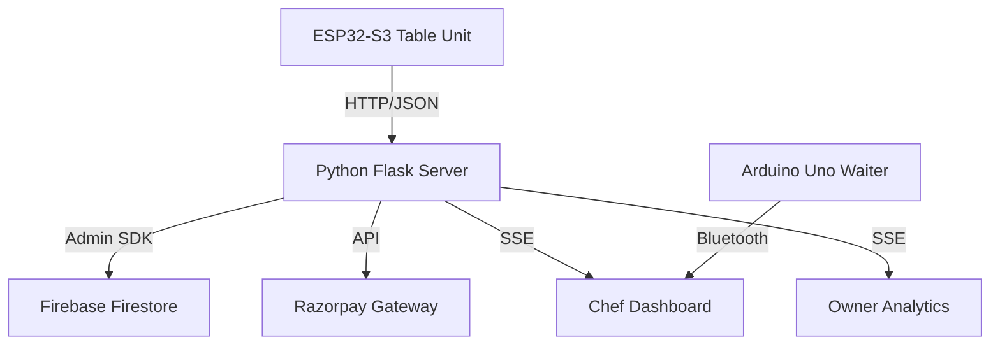

# 🍽️ AutoDine V4.0
### *Smart Restaurant Table-to-Kitchen Coordination Platform*

AutoDine is an industrial-grade IoT ecosystem designed to modernize restaurant operations. It replaces traditional paper menus with interactive, cloud-connected table units, automates order flow to the kitchen, and provides real-time business analytics for owners.

---

## 🚀 Key Features

*   **Interactive Menu (LVGL)**: Premium, high-speed UI on 7" ESP32-S3 HMI.
*   **Touch Payments**: Integrated Razorpay (UPI/QR) & Cash payment verification at the table.
*   **Deferred Networking**: 400ms Touch Stability Guard & Non-blocking state transitions.
*   **Cloud Backend**: Real-time Firebase Firestore database for menu and order sync.
*   **Waiter Robot**: Autonomous Arduino Uno-based bot for table delivery.
*   **Live Dashboards**: SSE-powered real-time kitchen and owner dashboards.

---

## 🏗️ System Architecture



---

## 🔌 Hardware Pin-to-Pin Guide (CrowPanel 7.0 HMI)

### **Display Architecture (LGFX + LVGL)**
| Component | Function | ESP32-S3 Pin | Mode |
| :--- | :--- | :--- | :--- |
| **LCD Data** | D0 - D7 | 15, 7, 6, 5, 4, 9, 46, 3 | 16-bit RGB |
| **LCD Data** | D8 - D15 | 8, 16, 1, 14, 21, 47, 48, 45| 16-bit RGB |
| **LCD Timing** | DE (Enable), VS, HS, PCLK | 41, 40, 39, 0 | Synchronous |
| **Backlight** | BL_EN | 2 | PWM Compatible |

### **Touch & Control**
| Component | Function | ESP32-S3 Pin |
| :--- | :--- | :--- |
| **Touch I2C** | SDA, SCL | 19, 20 |
| **Touch Reset**| RST (LCD_EN) | 38 |
| **Power Input**| 5V / GND | USB-C Port (2A Recommended) |

---

## 🛠️ Configuration & Setup

### **1. Cloud Setup (Firebase)**
1.  Download `firebase_credentials.json` from **Firebase Settings → Service Accounts**.
2.  Place it in the `/server` directory.
3.  Enable **Firestore Database** in Native Mode.

### **2. Backend Setup (Flask)**
1.  Set your credentials in `/server/.env`:
    ```env
    RAZORPAY_KEY_ID=your_id
    RAZORPAY_KEY_SECRET=your_secret
    ```
2.  Install dependencies: `pip install flask flask_cors firebase-admin razorpay python-dotenv qrcode`
3.  Run: `python server.py --host 0.0.0.0` (Note your computer IP).

### **3. Table Firmware (Arduino)**
1.  Open `AutoDine_Table_Ino/AutoDine_Table_Ino.ino`.
2.  Set your computer's IP in `app_config.h`.
3.  **Board Settings**: 
    - Board: **ESP32S3 Dev Module**
    - PSRAM: **OPI PSRAM** (Critical)
    - USB Mode: **Hardware CDC and JTAG**

---

## 📺 Project Evolution (Demo Videos)

-   **[V1.0 - Initial Prototype](file:///d:/e/Major_Project/Demo_V1.0.mp4)**: Core menu testing.
-   **[V2.0 - Network Sync](file:///d:/e/Major_Project/Demo_V2.0.mp4)**: Order flow verification.
-   **[V3.0 - Razorpay Integration](file:///d:/e/Major_Project/Demo_V3.0.mp4)**: Live UPI testing.
-   **[V3.5 - UI Overhaul](file:///d:/e/Major_Project/Demo_V3.5.mp4)**: Glassmorphism design and animations.

---

## 📂 Project Directory Structure

- **[/AutoDine_Table_Ino](file:///d:/e/Major_Project/AutoDine_Table_Ino)**: ESP32-S3 Firmware (Arduino/LVGL).
- **[/server](file:///d:/e/Major_Project/server)**: Python Backend, Firebase logic, and Web Dashboards.
- **[/AutoDine_Waiter](file:///d:/e/Major_Project/AutoDine_Waiter)**: Arduino Uno Robot Firmware.
- **[/Resources](file:///d:/e/Major_Project/Resources)**: Project media and design assets.

---
**Maintained by [Jathin Pusuluri](https://github.com/Jathin021)**
